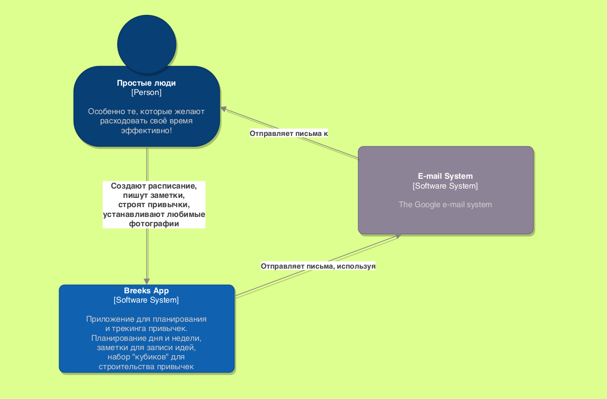
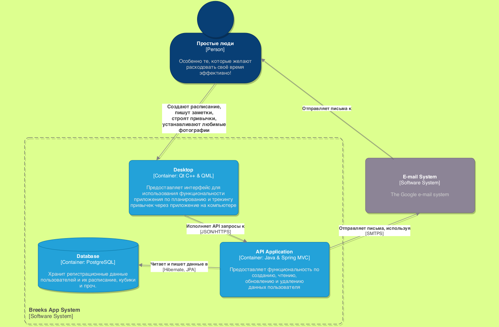

# Breeks-presentation
Клиент-серверное приложение *для трекинга привычек и планирования*.  
* [Десктоп Breeks](https://github.com/BreeksApp/Breeks-desktop)
* [Сервер Breeks](https://github.com/BreeksApp/Breeks-server)

## :outbox_tray: Скачать
* [On Windows](https://github.com/BreeksApp/Breeks-desktop/releases/download/1.0/BreeksWindowsSetup.exe)
* [On Linux](https://github.com/BreeksApp/Breeks-desktop/releases/download/1.0/BreeksLinuxSetup.run)  

Кроме использования исходного кода, есть возможность скачать **установщик** десктопного приложения.  
После этого вы сможете запустить приложение, зарегистрировать свой аккаунт и начать работу!  
Сервер приложения запущен на одном из облачных сервисов.

## :pushpin: Проблема

Как часто вы думаете о том, что **24 часов в сутках недостаточно**?  
Категорически не хватает времени на то, чтобы все успеть! А ведь и проснулись рано, и весь день провели за работой.  
Однако выполнить задание в срок так и не удалось, не успели встретиться с друзьями, не позвонили родным...  
Пришло время взглянуть на то, куда по-настоящему уходит время!  
Как распыляясь, не получается достигнуть ни одной цели. И насколько все это циклично.  

Мы создали инструмент, который поможет ***определить на что тратится время***, чтобы вы, наконец, смогли ***перевернуть*** представление о собственной продуктивности.

Встречайте, **BREEKS** 🤠 

## :man: Команда проекта, академическая группа (СПбПУ Политех Петра Великого)
**3530904/80101:**
* [Пылаев Ярослав](https://github.com/Yang-Pi)
* [Трофимов Филипп](https://github.com/undergroundenemy616)
* [Голиков Георгий](https://github.com/GeorgeGolikov)

## :scroll: О требованиях: Jobs to be done
* Когда я регистрируюсь в сервисе, я хочу подтвердить свои намерения по почте, чтобы я далее точно мог легко авторизоваться.  
* Когда я работаю в приложении, я хочу корректно сохранять свои данные, чтобы потом к ним спокойно обращаться.  
* Когда я захожу в приложение, я хочу увидеть сохраненными свои данные, чтобы продолжить с ними работу.  
* Когда я переключаю недели, я хочу изменять отображающиеся данные, чтобы видеть только те, которые относятся к текущей неделе.  
* Когда я пишу заметки, я хочу иметь возможность форматировать текст, чтобы информация выглядела более структурированно.  
* Когда я добавляю кубики или элементы расписания, я хочу иметь возможность задавать цвет и эмоджи, чтобы представлять свое время наглядно.  

## :house: Об архитектуре
* [System Context Diagram](./diagrams/ContextDiagram.pdf) 

* [System Container Diagram](./diagrams/ContainerDiagram.pdf)

## :bug: Кодирование и отладка
Результаты работы можно видеть в смежных репозиториях:
* [Сервер](https://github.com/BreeksApp/Breeks-server)
* [Десктоп](https://github.com/BreeksApp/Breeks-desktop)  

В [Сервере](https://github.com/BreeksApp/Breeks-server) описаны сборка, запуск и тестирование приложения.  
Интеграционное тестирование покрывает первые 2 требования из **Jobs to be done**.  
В [Десктопе](https://github.com/BreeksApp/Breeks-desktop) можно рассмотреть внешний вид приложения, собрать его из исходников  
или скачать уже собранное приложение.
